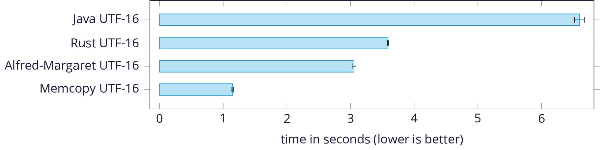

# Alfred-Margaret

Alfred-Margaret is a fast implementation of the Aho-Corasick string
searching algorithm in Haskell. It powers many string-related operations
in [Channable][channable].

The library is designed to work with the [`text`][text] package. It matches
directly on the internal UTF-16 representation of `Text` for efficiency. See the
[announcement blog post][blog-post] for a deeper dive into Aho-Corasick, and the
optimizations that make this library fast.

Alfred-Margaret is named after Alfred Aho and Margaret Corasick.

## Performance

Running time to count all matches, in a real-world data set,
comparing [a Java implementation][hankcs] and [a Rust implementation][burntsushi]
against Alfred-Margaret, and against memcopy to establish a lower bound:

<p align="center">

</p>

For the full details of this benchmark, see
[our announcement blog post][blog-post], which includes more details about the
data set, the benchmark setup, and a few things to keep in mind when
interpreting this graph.

## Example

Check if a string contains one of the needles:

```haskell
import qualified Data.Text.AhoCorasick.Searcher as Searcher

searcher = Searcher.build ["tshirt", "shirts", "shorts"]

Searcher.containsAny searcher "short tshirts"
> True

Searcher.containsAny searcher "long shirt"
> False

Searcher.containsAny searcher "Short TSHIRTS"
> False

Searcher.containsAnyIgnoreCase searcher "Short TSHIRTS"
> True
```

Sequentially replace many needles:

```haskell
import Data.Text.AhoCorasick.Automaton (CaseSensitivity (..))
import qualified Data.Text.AhoCorasick.Replacer as Replacer

replacer = Replacer.build CaseSensitive [("tshirt", "banana"), ("shirt", "pear")]

Replacer.run replacer "tshirts for sale"
> "bananas for sale"

Replacer.run replacer "tshirts and shirts for sale"
> "bananas and pears for sale"

Replacer.run replacer "sweatshirts and shirtshirts"
> "sweabananas and shirbananas"

Replacer.run replacer "sweatshirts and shirttshirts"
> "sweabananas and pearbananas"
```

Get all matches, possibly overlapping:

```haskell
import qualified Data.Text.AhoCorasick.Automaton as Aho

pairNeedleWithSelf text = (Aho.unpackUtf16 text, text)
automaton = Aho.build $ fmap pairNeedleWithSelf ["tshirt", "shirts", "shorts"]
allMatches = Aho.runText [] (\matches match -> Aho.Step (match : matches))

allMatches automaton "short tshirts"
> [ Match {matchPos = CodeUnitIndex 13, matchValue = "shirts"}
> , Match {matchPos = CodeUnitIndex 12, matchValue = "tshirt"}
> ]

allMatches automaton "sweatshirts and shirtshirts"
> [ Match {matchPos = CodeUnitIndex 27, matchValue = "shirts"}
> , Match {matchPos = CodeUnitIndex 26, matchValue = "tshirt"}
> , Match {matchPos = CodeUnitIndex 22, matchValue = "shirts"}
> , Match {matchPos = CodeUnitIndex 11, matchValue = "shirts"}
> , Match {matchPos = CodeUnitIndex 10, matchValue = "tshirt"}
> ]
```

## License

Alfred-Margaret is licensed under the 3-clause BSD license.

[channable]:  https://www.channable.com/
[blog-post]:  https://tech.channable.com/TODO
[text]:       https://github.com/haskell/text
[hankcs]:     https://github.com/hankcs/AhoCorasickDoubleArrayTrie/tree/v1.2.0
[burntsushi]: https://github.com/BurntSushi/aho-corasick/tree/0.6.8
